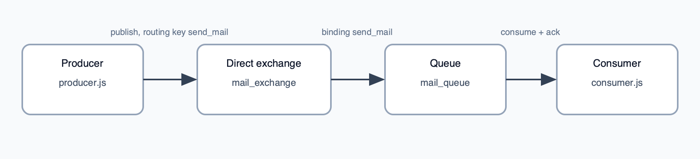

# L1 — Hello RabbitMQ: direct exchange and one queue

This folder is the smallest end-to-end example: a **producer** publishes a JSON “mail” payload, and a **consumer** reads it from a single queue. It introduces the core RabbitMQ ideas: **connection**, **channel**, **exchange**, **queue**, **binding**, and **routing key**.

## What’s in this folder

| File           | Role                                                                                                                                                                |
| -------------- | ------------------------------------------------------------------------------------------------------------------------------------------------------------------- |
| `producer.js`  | Connects to RabbitMQ, declares a **direct** exchange `mail_exchange`, queue `mail_queue`, binds the queue with routing key `send_mail`, then publishes one message. |
| `consumer.js`  | Declares the same queue `mail_queue` and **consumes** messages, parses JSON, and **acks** each message.                                                             |
| `package.json` | Node ESM project with `amqplib` (and `nodemon` as a dev dependency).                                                                                                |

## Conceptual diagram



## Prerequisites

- RabbitMQ running locally (default in code: `amqp://localhost:5672`).

## How to run

From the `L1` directory:

```bash
npm install
```

In one terminal:

```bash
node consumer.js
```

In another:

```bash
node producer.js
```

You should see the consumer log the same JSON object the producer sent.
