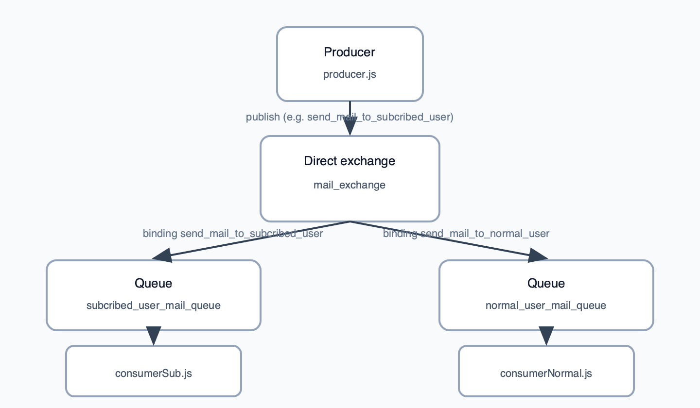

# L2 — Direct exchange: multiple queues and routing keys

This folder extends L1 by using the same **direct** exchange pattern with **two routing keys** and **two queues**, so you can route different kinds of work to different consumers. The producer still uses exchange `mail_exchange`, but binds two queues with distinct routing keys.

## What’s in this folder

| File | Role |
|------|------|
| `producer.js` | Declares `mail_exchange` (direct), queues `subcribed_user_mail_queue` and `normal_user_mail_queue`, binds them to routing keys `send_mail_to_subcribed_user` and `send_mail_to_normal_user`, then publishes **one** message using the subscribed-user routing key (see diagram). |
| `consumerSub.js` | Consumes from `subcribed_user_mail_queue`. |
| `consumerNormal.js` | Consumes from `normal_user_mail_queue`. |
| `package.json` | Same stack as L1 (`amqplib`, ESM). |

## Conceptual diagram



With a **direct** exchange, only queues whose binding key **equals** the message routing key receive a copy. If you change the producer to publish with `send_mail_to_normal_user`, only `consumerNormal.js` would receive that message (assuming the other consumer is bound to the other queue).

## Prerequisites

- RabbitMQ at `amqp://localhost:5672`.

## How to run

From the `L2` directory:

```bash
npm install
```

Start both consumers (two terminals):

```bash
node consumerSub.js
```

```bash
node consumerNormal.js
```

Then run the producer:

```bash
node producer.js
```

By default, only the subscribed-queue consumer should print the message; switch the routing key in `producer.js` to exercise the normal-user path.
