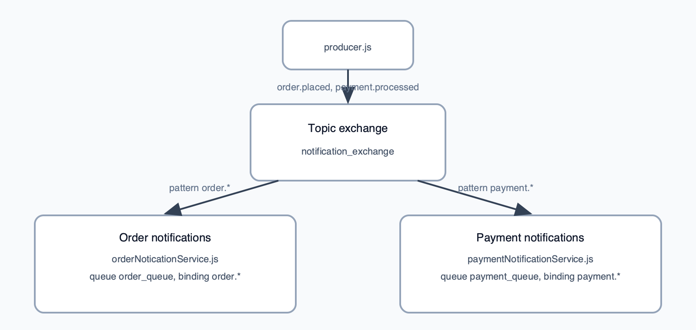

# L3 — Topic exchange: pattern-based routing

This folder demonstrates a **topic** exchange: publishers use **dot-separated** routing keys (e.g. `order.placed`, `payment.processed`), and consumers bind queues with **patterns** using `*` (one word) and `#` (zero or more words). Here only `*` is used so each service listens to a whole “namespace” of events.

## What’s in this folder

| File | Role |
|------|------|
| `producer.js` | Declares `notification_exchange` as **topic**, then publishes two messages: one with routing key `order.placed`, one with `payment.processed`. |
| `orderNoticationService.js` | Declares the exchange, queue `order_queue`, binds with pattern `order.*`, and consumes order-related events. |
| `paymentNotificationService.js` | Same exchange, queue `payment_queue`, binding `payment.*`, for payment-related events. (In this sample, `payment_queue` is declared **durable** while `order_queue` is not—useful to notice when learning persistence settings.) |
| `package.json` | Same dependencies as L1/L2. |

## Conceptual diagram



Each service process declares the exchange, its queue, the binding pattern, then consumes that queue; the arrows summarize which routing keys reach which subscriber.

**Topic routing** lets many event types share one exchange while each subscriber declares **what subset** it cares about. For example, `order.*` matches `order.placed` and `order.cancelled` but not `payment.refunded`.

## Prerequisites

- RabbitMQ at `amqp://localhost:5672`.

## How to run

From the `L3` directory:

```bash
npm install
```

Start the two services (two terminals):

```bash
node orderNoticationService.js
```

```bash
node paymentNotificationService.js
```

Then run the producer:

```bash
node producer.js
```

You should see the order service handle the order event and the payment service handle the payment event, each on its own queue.
